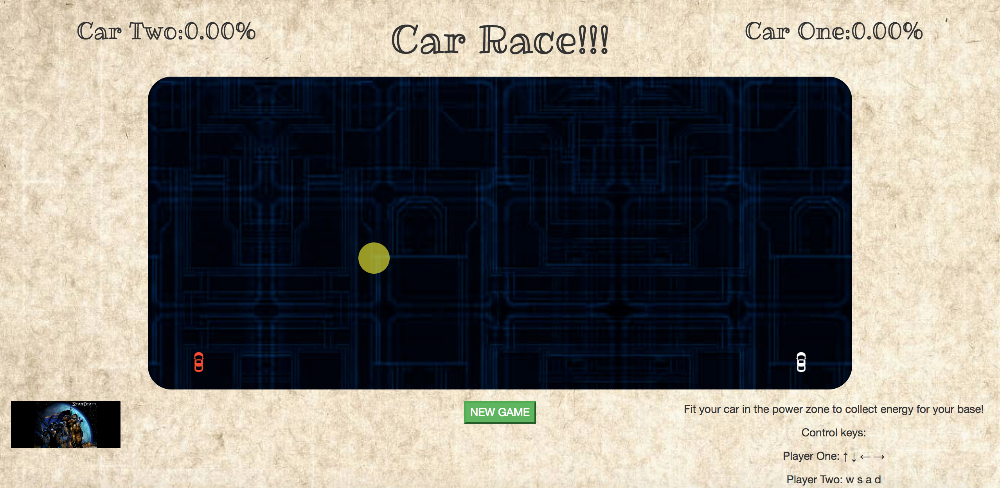

# Racing Game

This is a racing game in which two players can control their cars and chase after the random moving object to charge energy. The first car that charged the energy to 100% wins!

## Technologies Used

* **JQuery**: This is a really useful tool to retrieve elements from my html file for the use in JS.
* **Animate.css**: I've been using this since my first webpage game. This is very useful and easy to manipulate.
* **Bootstrap**: This is to me the best way to control my webpage layout. With Bootstrap, my own .css file gets light and clean.
* **Youtube**: Usually I'd like to have some background music in my page. Considering that downloading music may be illigal, I chose to embed a youtube link at the page footer and set autoplay.

## Existing Features

* Starting countdown
* Restart button
* Score board(energy percentage)
* Randomly moving object
* Smoothly moving car
* Car image rotates as direction changes

## Planned Features

* Recreate the game using object constructor.
* Make something happen when the two cars collide.

---

##### Screenshot

##### Link to hosted project on GitHub pages or BitBalloon (optional)
